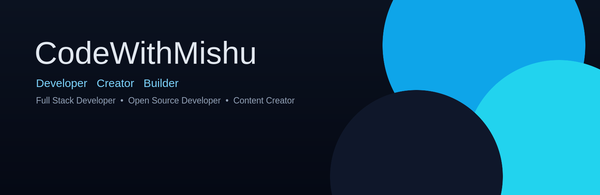
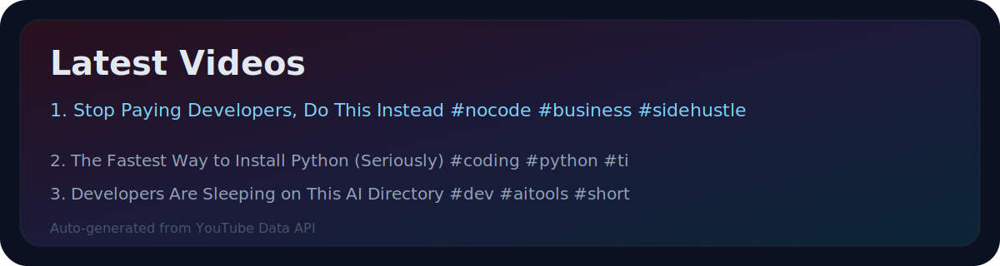
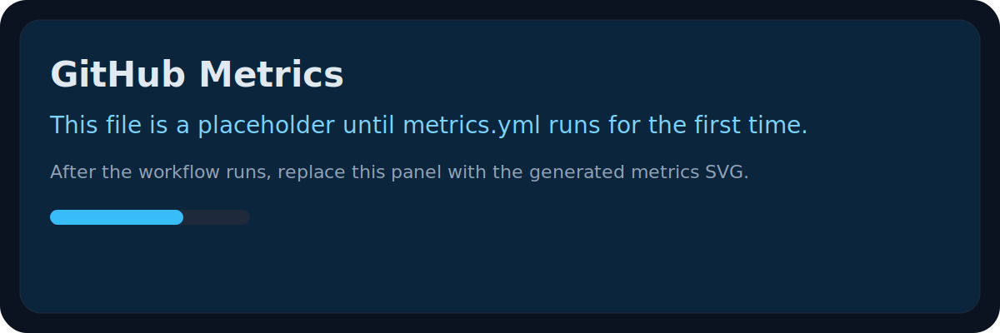
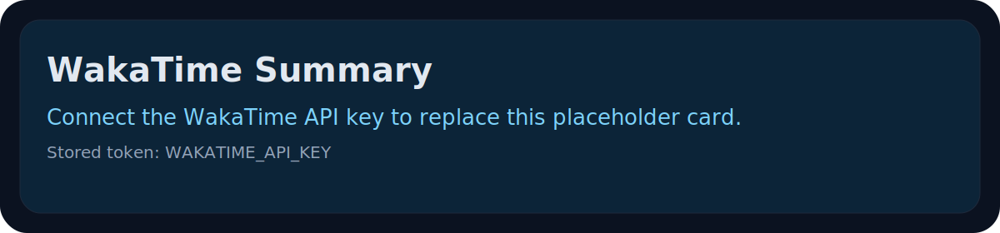

<!-- HERO -->
<p align="center">
  
</p>

<h1 align="center">
   CodeWithMishu
</h1>

<p align="center">
  
</p>

<p align="center">
  I build product-focused software, ship in public, and design developer experiences that feel sharp, useful, and trustworthy.
</p>

<!-- SOCIAL BUTTONS -->
<p align="center">
  <a href="https://github.com/CodeWithMishu" target="_blank"></a>
  <a href="https://codewithmishu.in" target="_blank"></a>
  <a href="https://www.linkedin.com/in/codewithmishu" target="_blank"></a>
  <a href="https://www.youtube.com/@CodeWithMishu" target="_blank"></a>
  <a href="https://www.instagram.com/codewithmishu?igsh=MTg0MDR4eHdjaG1uaA==" target="_blank"></a>
  <a href="https://x.com/CodeWithMishu" target="_blank"></a>
  <a href="mailto:codewithmishu@gmail.com"></a>
  <a href="https://links.codewithmishu.in" target="_blank"></a>
</p>

<!-- ABOUT -->
## About

<table>
  <tr>
    <td width="60%">

```yaml
name: Munish Kumar Sharma
brand: CodeWithMishu
role:
  - Full Stack Developer
  - Open Source Developer
  - Content Creator
status: BCA Student
focus:
  - Full Stack Development
  - React and Next.js
  - Java, DSA, PostgreSQL, System Design
values:
  - build products, not prototypes
  - keep shipping in public
  - stay clear, consistent, and useful
goals:
  - become a strong product engineer
  - grow WorldNote into a real brand
  - create content that helps developers build better
```

    </td>
    <td width="40%" align="center">
      
    </td>
  </tr>
</table>

<!-- CURRENT FOCUS -->
## Current Focus

<table>
  <tr>
    <td width="50%">
      <strong>Now Building</strong><br>
      WorldNote and product-grade web apps with clean UX, strong architecture, and clear value.
    </td>
    <td width="50%">
      <strong>Now Learning</strong><br>
      Advanced React, Next.js, Java, PostgreSQL, system design, and practical DSA patterns.
    </td>
  </tr>
  <tr>
    <td width="50%">
      <strong>Open Source</strong><br>
      Improving public repositories, reusable tooling, and developer-first workflows.
    </td>
    <td width="50%">
      <strong>Daily Coding</strong><br>
      Building consistency through focused practice, shipping, and review.
    </td>
  </tr>
</table>

<p align="center">
  <strong>Content Creation:</strong> teaching what I learn while I build.
</p>

<!-- TECH STACK -->
## Tech Stack

<table>
  <tr>
    <td><strong>Languages</strong><br></td>
    <td><strong>Frontend</strong><br></td>
  </tr>
  <tr>
    <td><strong>Backend</strong><br></td>
    <td><strong>Database</strong><br></td>
  </tr>
  <tr>
    <td><strong>Cloud</strong><br></td>
    <td><strong>DevOps</strong><br></td>
  </tr>
  <tr>
    <td><strong>Tools</strong><br></td>
    <td><strong>Operating Systems</strong><br></td>
  </tr>
  <tr>
    <td colspan="2"><strong>Design</strong><br></td>
  </tr>
</table>

<!-- DEVELOPER TOOLBOX -->
## Developer Toolbox

<p align="center">
  
</p>

<!-- FEATURED PROJECTS -->
## Featured Projects

<table>
  <tr>
    <td width="50%">
      <h3><a href="https://github.com/CodeWithMishu/WebRun">WebRun</a></h3>
      <p>A streamlined execution environment for developers to test, preview, and iterate on ideas faster.</p>
      <p><strong>Tech:</strong> TypeScript, React, Node.js, APIs</p>
      <p><strong>Status:</strong> Active build</p>
      <p><strong>Repo:</strong> <a href="https://github.com/CodeWithMishu/WebRun">CodeWithMishu/WebRun</a></p>
    </td>
    <td width="50%">
      <h3><a href="https://github.com/CodeWithMishu/GitGuard">GitGuard</a></h3>
      <p>Developer safety and repository hygiene tooling built to keep projects consistent and maintainable.</p>
      <p><strong>Tech:</strong> TypeScript, GitHub APIs, automation</p>
      <p><strong>Status:</strong> Active build</p>
      <p><strong>Repo:</strong> <a href="https://github.com/CodeWithMishu/GitGuard">CodeWithMishu/GitGuard</a></p>
    </td>
  </tr>
  <tr>
    <td width="50%">
      <h3><a href="https://github.com/CodeWithMishu/HexFetch">HexFetch</a></h3>
      <p>A clean utility layer for fetching data with a stronger developer experience and fewer moving parts.</p>
      <p><strong>Tech:</strong> JavaScript, APIs, data tooling</p>
      <p><strong>Status:</strong> Experimental</p>
      <p><strong>Repo:</strong> <a href="https://github.com/CodeWithMishu/HexFetch">CodeWithMishu/HexFetch</a></p>
    </td>
    <td width="50%">
      <h3><a href="https://github.com/CodeWithMishu/Mishu-Theme">Mishu Theme</a></h3>
      <p>A visual theme system for a sharper, more intentional development environment.</p>
      <p><strong>Tech:</strong> TypeScript, UI theming, design systems</p>
      <p><strong>Status:</strong> In progress</p>
      <p><strong>Repo:</strong> <a href="https://github.com/CodeWithMishu/Mishu-Theme">CodeWithMishu/Mishu-Theme</a></p>
    </td>
  </tr>
  <tr>
    <td width="50%">
      <h3><a href="https://github.com/CodeWithMishu/OpenTunnel">OpenTunnel</a></h3>
      <p>A public utility project focused on developer workflows and local connectivity tooling.</p>
      <p><strong>Tech:</strong> TypeScript, developer tooling</p>
      <p><strong>Status:</strong> Active build</p>
      <p><strong>Repo:</strong> <a href="https://github.com/CodeWithMishu/OpenTunnel">CodeWithMishu/OpenTunnel</a></p>
    </td>
    <td width="50%">
      <h3><a href="https://github.com/CodeWithMishu/DSA-in-Java">DSA-in-Java</a></h3>
      <p>Structured Java-based problem solving for interview prep, practice, and long-term fundamentals.</p>
      <p><strong>Tech:</strong> Java, DSA, problem solving</p>
      <p><strong>Status:</strong> Active learning repo</p>
      <p><strong>Repo:</strong> <a href="https://github.com/CodeWithMishu/DSA-in-Java">CodeWithMishu/DSA-in-Java</a></p>
    </td>
  </tr>
</table>

<p align="center">
  <strong>Private products:</strong> WorldNote and TeamCareerGurus are in active development and not public yet.
</p>

<!-- OPEN SOURCE -->
## Open Source

<table>
  <tr>
    <td width="33%">
      <strong>VS Code Extensions</strong><br>
      Utility-first extensions that improve the everyday developer workflow.
    </td>
    <td width="33%">
      <strong>Public Repositories</strong><br>
      Real projects, reusable components, and public shipping discipline.
    </td>
    <td width="33%">
      <strong>Community Contributions</strong><br>
      Issues, docs, reviews, and helpful collaboration wherever it matters.
    </td>
  </tr>
</table>

<!-- WAVE DIVIDER -->
<p align="center">
  
</p>

<!-- MY SETUP -->
## My Setup

<table>
  <tr>
    <td width="50%">
      <strong>Development</strong><br>
      <br>
      VS Code, Git, GitHub, Postman
    </td>
    <td width="50%">
      <strong>Runtime and Deploy</strong><br>
      <br>
      Node.js, Docker, Vercel, Cloudflare
    </td>
  </tr>
  <tr>
    <td width="50%">
      <strong>Operating System</strong><br>
      <br>
      Linux (Daily Driver)
    </td>
    <td width="50%">
      <strong>Design and Creative</strong><br>
      <br>
      Figma, SVG, Custom Themes
    </td>
  </tr>
</table>

<!-- WHAT I'M READING -->
## What I'm Reading

| Book | Author | Focus |
|------|--------|-------|
| *Clean Code* | Robert C. Martin | Writing maintainable, readable code |
| *System Design Interview* | Alex Xu | Architecture and scalability patterns |
| *Designing Data-Intensive Applications* | Martin Kleppmann | Distributed systems and data foundations |
| *The Pragmatic Programmer* | David Thomas and Andrew Hunt | Software craftsmanship and professional growth |

<!-- LATEST FROM MY YOUTUBE -->
## Latest from YouTube

<p align="center">
  
</p>

<!-- GITHUB STATS -->
## GitHub Statistics

<table>
  <tr>
    <td></td>
    <td></td>
  </tr>
  <tr>
    <td></td>
    <td></td>
  </tr>
</table>

<p align="center">
  
</p>

<table>
  <tr>
    <td></td>
    <td></td>
  </tr>
  <tr>
    <td></td>
    <td></td>
  </tr>
</table>

<!-- ACHIEVEMENTS -->
## Achievements

<p align="center">
  
  
  
  
</p>

<!-- TESTIMONIALS -->
## What People Say

<table>
  <tr>
    <td width="50%">
      <blockquote>
        "Mishu's work on WebRun shows real product thinking. Clean architecture, clear intent."
      </blockquote>
      <p><strong>-- Add Name Here</strong></p>
    </td>
    <td width="50%">
      <blockquote>
        "One of the most consistent builders I know. Ships daily and documents everything."
      </blockquote>
      <p><strong>-- Add Name Here</strong></p>
    </td>
  </tr>
</table>

<!-- FUN FACTS -->
## Fun Facts

- I write code in the early morning and ship products at night.
- I have used Linux for more than I have used Windows.
- I once refactored an entire project in a single weekend just because the architecture felt wrong.
- I prefer dark mode not just for the eyes but for the vibe.
- I believe good documentation is a feature, not a chore.

<!-- SUPPORT AND SPONSORS -->
## Support and Sponsors

<p align="center">
  <a href="https://github.com/sponsors/CodeWithMishu" target="_blank"></a>
  <a href="https://www.buymeacoffee.com/codewithmishu" target="_blank"></a>
</p>

<p align="center">
  If my work helps you, consider supporting the journey. Every bit keeps the momentum going.
</p>

<!-- PHILOSOPHY -->
## Developer Philosophy

> Build real products. Keep the interface clear. Make the codebase durable. Ship the work publicly.

<!-- GOALS -->
## 2026 Goals

<table>
  <tr>
    <td>Become SDE</td>
    <td>Launch SaaS</td>
    <td>1000 GitHub Stars</td>
  </tr>
  <tr>
    <td>100K YouTube</td>
    <td>Grow Open Source</td>
    <td>Keep building in public</td>
  </tr>
</table>

<!-- QUOTE -->
## Quote

> Simplicity is the highest form of sophistication.

<!-- LET'S CONNECT -->
## Let's Connect

<p align="center">
  <a href="https://calendly.com/codewithmishu" target="_blank"></a>
  <a href="mailto:codewithmishu@gmail.com"></a>
  <a href="https://x.com/CodeWithMishu" target="_blank"></a>
</p>

<p align="center">
  Open to collaboration, feedback, and conversations about building in public.
</p>

<!-- FOOTER -->
<p align="center">
  
</p>

<p align="center"><strong>Thank you for visiting.</strong><br>Built with heart by CodeWithMishu.</p>

<!-- OPTIONAL CONFIG -->
<details>
<summary>Profile setup notes</summary>

<p>
Keep the repository public, then replace the placeholder links and images as your projects evolve. The automation files under <code>.github/workflows</code> are intentionally commented so you can wire in tokens only where needed. The featured repositories are linked to public GitHub URLs only; private products stay named but unlinked until they are public.
</p>

</details>
