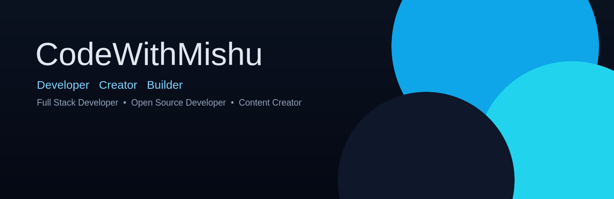

<!-- =========================================================
     CODEWITHMISHU — GITHUB PROFILE README
     ========================================================= -->

<p align="center">
  
</p>

<h1 align="center">Hey, I'm Munish 👋</h1>

<p align="center">
  <strong>Developer · Builder · Educator · Open Source</strong>
</p>

<p align="center">
  I build real-world software, share what I learn, and create content & tools that help developers build better.
</p>

<p align="center">
  <a href="https://codewithmishu.in">Portfolio</a> ·
  <a href="https://www.youtube.com/@CodeWithMishu">YouTube</a> ·
  <a href="https://www.linkedin.com/in/codewithmishu">LinkedIn</a> ·
  <a href="https://www.instagram.com/codewithmishu">Instagram</a> ·
  <a href="https://x.com/CodeWithMishu">X</a>
</p>

<p align="center">
  
  
</p>

---

## 🧑‍💻 About Me

I'm **Munish**, the developer behind **CodeWithMishu**.

I enjoy turning ideas into working products — from developer tools and web applications to open-source projects and educational content.

I'm currently focused on becoming a stronger **full-stack/product engineer** while building CodeWithMishu into a place where developers can **learn, build, and grow together**.

```text
BUILD       → Real-world products & developer tools
LEARN       → Full-stack development, DSA & system design
SHARE       → Tutorials, shorts, projects & developer content
OPEN SOURCE → Tools, extensions & reusable software
```

### What I care about

* 🧠 Learning by building instead of just consuming tutorials
* 🛠️ Creating software that solves actual problems
* 🌍 Sharing what I learn in public
* 🧩 Improving developer experience
* 🚀 Shipping projects instead of leaving them as ideas
* 📚 Helping other developers learn through practical content

---

## 🚀 What I'm Building

### 🌐 CodeWithMishu

A developer-focused personal brand where I share:

* Full-stack development
* JavaScript & React
* Web development
* DSA & problem solving
* Developer tools
* Projects & practical tutorials
* Open-source experiments

**Learn → Build → Share.**

👉 [Visit CodeWithMishu](https://codewithmishu.in)

---

### 🏢 WorldNote

Building **WorldNote** as a digital product & technology company focused on helping businesses turn ideas into useful digital experiences.

**Areas:** Web · Apps · Software · Branding · Digital Solutions

👉 [worldnote.in](https://worldnote.in)

---

## 🛠️ Things I Build With

### Languages

<p>
  
</p>

### Frontend

<p>
  
</p>

### Backend & APIs

<p>
  
</p>

### Databases

<p>
  
</p>

### DevOps & Cloud

<p>
  
</p>

### Tools

<p>
  
</p>

> My stack will keep changing. The goal isn't collecting technologies — it's becoming better at solving problems.

---

## ⭐ Featured Projects

<table>
<tr>
<td width="50%">

### 🏃 WebRun

A developer-focused execution environment designed to make testing, previewing and experimenting with ideas faster.

**TypeScript · React · Node.js**

<a href="https://github.com/CodeWithMishu/WebRun">View Repository →</a>

</td>

<td width="50%">

### 🛡️ GitGuard

Developer tooling focused on repository hygiene, consistency and safer development workflows.

**TypeScript · GitHub APIs · Automation**

<a href="https://github.com/CodeWithMishu/GitGuard">View Repository →</a>

</td>
</tr>

<tr>
<td width="50%">

### 🎨 Mishu Theme

A VS Code theme created for developers who want a clean and intentional coding environment.

**TypeScript · VS Code · UI**

<a href="https://github.com/CodeWithMishu/Mishu-Theme">View Repository →</a>

</td>

<td width="50%">

### 🚇 OpenTunnel

A developer utility focused on local development workflows and connectivity.

**TypeScript · Developer Tooling**

<a href="https://github.com/CodeWithMishu/OpenTunnel">View Repository →</a>

</td>
</tr>

<tr>
<td width="50%">

### 📦 HexFetch

An experimental utility layer focused on making data fetching and API workflows simpler.

**JavaScript · APIs**

<a href="https://github.com/CodeWithMishu/HexFetch">View Repository →</a>

</td>

<td width="50%">

### 🧠 DSA in Java

My journey through data structures and algorithms using Java.

**Java · DSA · Problem Solving**

<a href="https://github.com/CodeWithMishu/DSA-in-Java">View Repository →</a>

</td>
</tr>
</table>

---

## 🌱 Open Source

I like building things that other developers can actually use.

Currently exploring:

* 🔧 VS Code extensions
* 🧰 Developer utilities
* ⚙️ Automation & tooling
* 📦 Reusable libraries
* 📖 Documentation & developer education
* 🤝 Open-source collaboration

If something here is useful to you, **star it, try it, break it, or tell me how to make it better.**

That's how good open source gets built.

---

## 🎥 I Also Create Content

I document what I'm learning and building through practical developer content.

### On YouTube

I create videos around:

* Web development
* JavaScript
* CSS
* React
* VS Code
* Developer tools
* Programming tips
* Projects
* Learning in public

<p align="center">
  <a href="https://www.youtube.com/@CodeWithMishu">
    
  </a>
</p>

### The idea is simple:

> **Don't just learn it. Build it. Then teach it.**

---

## 📊 GitHub Activity

<p align="center">
  
</p>

<p align="center">
  
</p>

<p align="center">
  
</p>

---

## 🧭 Currently Learning

```text
Full Stack Development
        ↓
React + Next.js
        ↓
Backend Architecture
        ↓
PostgreSQL + Data
        ↓
DSA + Problem Solving
        ↓
System Design
        ↓
Better Products
```

I'm less interested in memorizing frameworks and more interested in understanding **why things work**.

---

## 📈 2026

This year I'm focused on:

* 🚀 Growing CodeWithMishu
* 💻 Becoming a stronger software/product engineer
* 🌍 Building useful open-source projects
* 🎥 Growing my developer audience
* 🧠 Getting seriously better at DSA & system design
* 🏗️ Launching products instead of just prototypes
* 🤝 Meeting and collaborating with more developers

---

## 💡 My Philosophy

> **Learn in public. Build in private when necessary. Ship when ready.**

And one rule I try to follow:

> **Don't build another tutorial project just to say you built one. Build something someone might actually use.**

---

## 🤝 Let's Connect

Whether you found me through GitHub, YouTube, LinkedIn, or one of my projects — feel free to say hi.

<p align="center">

<a href="https://codewithmishu.in">

</a>

<a href="https://www.youtube.com/@CodeWithMishu">

</a>

<a href="https://www.linkedin.com/in/codewithmishu">

</a>

<a href="https://www.instagram.com/codewithmishu">

</a>

<a href="https://x.com/CodeWithMishu">

</a>

</p>

<p align="center">
  <strong>CodeWithMishu</strong> · Learn. Build. Share. 🚀
</p>
